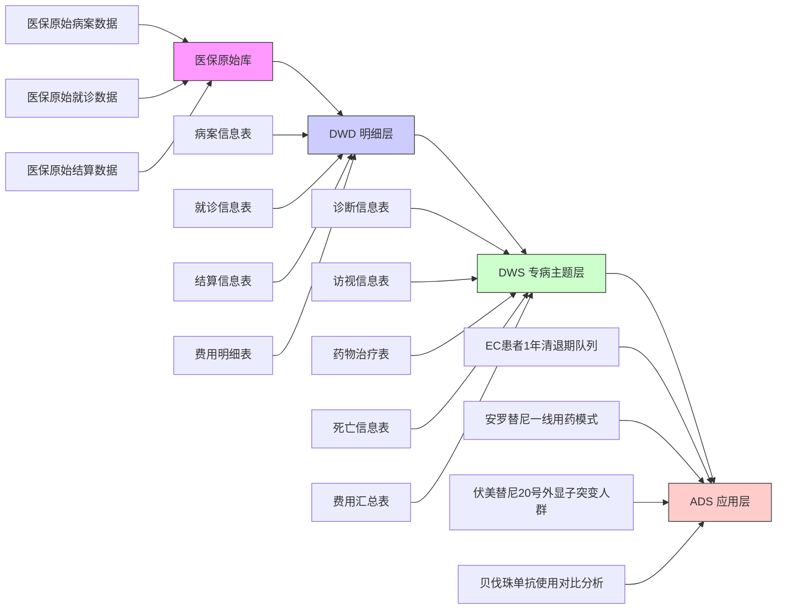

# 医疗数据治理岗位百问百答（V1.0）

> **定位**：面向医疗健康领域数据治理、专病库建设、医保数据商业化岗位的实战问答手册
> **原则**：问题来自真实面试/项目痛点，答案简洁、合规、可复用
> **更新记录**：2025-09-29 初版（基于与 AI 的诊断对话）

---

## 一、领域认知类

### Q1：数据治理的本质是什么？和生成标准格式数据有什么区别？

**A**：数据治理 ≠ 输出 CSV 或 JSON。其本质是 **“控制 + 透明 + 责任”**：

- **控制**：通过策略约束数据使用（如“专病库不得输出未脱敏身份证”）；
- **透明**：所有操作可记录、可查询（如任务日志、**[血缘图谱](#术语表-血缘图谱)**）；
- **责任**：问题可 **[溯源](#术语表-溯源a)**、权责可归属（如 DWS 层质量问题由我方负责）。

> ✅ 关键：治理是**管理行为**，不是**技术动作**。

---

### Q2：为什么“数据来自医保所以安全”是错误认知？

**A**：即使数据由医保局提供，我方作为**数据处理者**（《个人信息保护法》第 21 条），仍有法定义务：

- 识别敏感个人信息（如身份证号、诊断编码）；
- 采取去标识化措施；
- 记录处理活动。

> 🚫 错误引用 HIPAA（美国法律）！
> ✅ 正确依据：《个人信息保护法》《数据安全法》《医疗卫生机构数据安全管理办法》。

---

### Q3：医疗数据治理的核心交付物有哪些？为什么需要它们？

**A**：
除数据本身外，必须提供：

| 交付物                              | 解决谁的什么问题                                |
| ----------------------------------- | ----------------------------------------------- |
| **[血缘图谱](#术语表-血缘图谱)** | 监管方：验证数据来源是否合法、可追溯            |
| **[质量报告](#术语表-质量报告)** | 科研/分析团队：评估数据是否可信、可用           |
| **敏感字段清单**              | 医院/合作方：确认隐私保护措施到位，降低合规风险 |

> 💡 治理交付物 = **信任凭证**。

---

### Q4：为什么质量报告中还会存在“死亡日期 < 确诊日期”这类逻辑错误？为什么不直接剔除？已知数据缺口为何不“修复”？

#### 一、为什么会出现“死亡日期 < 确诊日期”？

这类“逻辑矛盾”在医保真实世界数据中**不可避免**，主要原因包括：

| 原因类型           | 具体场景                                             | 占比（示例） |
| ------------------ | ---------------------------------------------------- | ------------ |
| **填报错误** | 医院录入时手误（如将 2023 错填为 2032）              | ~40%         |
| **数据延迟** | 死亡信息由民政/公安回传，晚于医保结算                | ~30%         |
| **诊断滞后** | 患者先以“症状”就诊，数月后才确诊（但死亡记录先到） | ~20%         |
| **多源冲突** | 不同医院对同一患者的诊断/死亡时间记录不一致          | ~10%         |

> 📌 **关键认知**：
> **真实世界 ≠ 临床试验**。RWD 的价值恰恰在于反映“不完美但真实”的医疗实践，而非理想化数据。

---

#### 二、为什么不直接剔除这些记录？

**剔除 = 隐瞒数据缺陷，破坏研究真实性**。我们坚持 **“标注而非删除”** 原则，原因如下：

| 原则                        | 说明                                                                           |
| --------------------------- | ------------------------------------------------------------------------------ |
| **1. 保持数据完整性** | 剔除会导致患者队列选择性偏倚（如只保留“规范填报”医院），影响结论外推性       |
| **2. 支持敏感性分析** | 客户可自行决定：用全量数据（含矛盾） vs 清洗后数据（剔除矛盾），对比结果稳健性 |
| **3. 满足监管要求**   | FDA/EMA/NMPA 均要求 RWS 研究**披露数据局限性**，而非“美化数据”         |
| **4. 保留溯源能力**   | 若未来源系统修正错误，我们可重新计算，而非永久丢失原始记录                     |

> ✅ **我们的做法**：
>
> - 在 DWS 表中增加字段：`is_invalid = (death_date < diag_date)`；
> - 在质量报告中明确标注矛盾记录占比；
> - **不主动剔除，但提供过滤条件供下游使用**。

---

#### 三、已知数据缺口为何不“处理”（如插值、填充）？

**真实世界研究**（RWS）
我们严格遵循 **“不伪造、不推测”** 底线：

| 错误做法                     | 风险                                    |
| ---------------------------- | --------------------------------------- |
| **用均值填充缺失日期** | 破坏生存分析时序逻辑，导致 HR 偏倚      |
| **插值生成用药记录**   | 虚假增加治疗暴露，夸大药物效果          |
| **删除缺失患者**       | 引入选择偏倚（如缺失者多为 rural 患者） |

> 📜 **行业共识**（ISPE RWS 指南、FDA RWE Framework）：
> **“缺失数据应透明报告，而非技术性掩盖”**。

✅ **我们的处理方式**：

1. **标注**：在数据中打标 `data_missing = true`；
2. **隔离**：提供“完整数据子集”（如具备完整事件链的患者）；
3. **说明**：在质量报告中分析缺失模式（MCAR/MAR/MNAR）；
4. **建议**：指导客户采用多重插补（由统计师在 ADS 层执行，非 DWS 层）。

---

#### 四、如何向客户解释这种“不完美”？

我们强调：**“高质量 ≠ 无错误，而是可理解、可评估、可控制”**。

> **致客户说明**：“本专病库基于真实医保结算数据构建，包含少量逻辑矛盾（如死亡早于确诊，占比 0.3%）。
>
> - **我们未剔除或修改原始记录**，以保持数据真实性；
> - **所有矛盾记录已打标**，您可在分析时按需过滤；
> - **建议**：核心结论请在‘完整事件链患者’（76%）子集中验证，确保稳健性。
>
> 附件提供：
>
> - 《数据矛盾记录清单》
> - 《敏感性分析模板》（含过滤/不过滤对比）”

> 💡 **信任建立**：
> 客户更愿意相信**透明承认局限**的数据，而非“完美但可疑”的数据。

---

### Q5：如何理解一个“高质量的数据”？

#### 一、传统误区：高质量 ≠ “100% 准确 + 无缺失”

在真实世界数据（RWD）场景中，**追求绝对完美既不现实，也不科学**。

- 医院填报可能有误；
- 医保结算存在延迟；
- 患者跨院就诊导致信息割裂。

> ✅ **高质量数据的核心不是“没有问题”，而是“问题可知、可控、可解释”**。

---

#### 二、医疗数据的高质量 = **“四可”原则**

| 维度                           | 内涵                       | 你的 DWS 层实践                                       |
| ------------------------------ | -------------------------- | ----------------------------------------------------- |
| **可信**（Trustworthy）  | 数据逻辑合理，缺陷透明     | 标注“死亡日期 < 确诊日期”等矛盾记录，不隐藏、不删除 |
| **可用**（Usable）       | 满足分析场景的最小完整性   | 定义“有效患者”：具备诊断+用药+随访事件链            |
| **可控**（Controllable） | 敏感信息受保护，使用可审计 | 身份证哈希、住址模糊化，输出《敏感字段清单》          |
| **可溯**（Traceable）    | 来源清晰，变更可追踪       | 维护血缘图谱，记录 DWD → DWS 的字段映射与逻辑        |

> 💡 **高质量 = 在“真实”与“可用”之间取得负责任的平衡**。

---

#### 三、高质量数据的三大标志（医疗场景）

1. **有明确的业务定义**

   - 例：“晚期 NSCLC 患者” = ICD-10 C34.x + 医保结算中含“晚期”标识 + 无手术根治记录
   - ❌ 不是：“系统里所有肺癌患者”
2. **有透明的质量披露**

   - 例：质量报告中说明“2024-06 缺失某医院数据”“0.3% 记录存在逻辑矛盾”
   - ❌ 不是：“数据已清洗，可直接使用”
3. **有合理的使用边界**

   - 例：建议“生存率分析使用完整事件链患者（76%子集）”
   - ❌ 不是：“所有患者均可用于任何分析”

---

#### 四、高质量 vs 低质量：一个对比

| 场景               | 低质量数据                               | 高质量数据                                                                                                                             |
| ------------------ | ---------------------------------------- | -------------------------------------------------------------------------------------------------------------------------------------- |
| **交付药企** | “这是 2024 年肺癌患者数据，共 20 万人” | “这是 2019-2024 年肺癌患者数据（共 20 万人），其中 7.6 万人具备完整诊疗链，可用于生存分析；2.4 万人缺失随访，建议仅用于流行病学分布” |
| **处理矛盾** | 删除所有“死亡早于确诊”记录             | 保留原始记录，打标 `is_invalid=true`，供客户做敏感性分析                                                                             |
| **隐私保护** | 直接输出身份证号                         | 输出哈希 ID + 《敏感字段清单》+ 脱敏规则说明                                                                                           |

---

#### 五、总结：高质量数据的本质

> **高质量数据 = 可信的资产，而非完美的记录**。它不要求“零错误”，但要求：
>
> - **你知道它哪里可能错**（透明）
> - **你知道它能用来做什么**（场景适配）
> - **你知道谁该为它负责**（治理闭环）

在医疗数据领域，**承认局限性，才是专业性的开始**。

---

## 二、合规与法规类

### Q1：在中国，医疗数据项目应依据哪些法规？

**A**：必须掌握以下 **中国本土法规**（禁止引用 HIPAA！）：

- 《**个人信息保护法**》（PIPL）：第 4、13、21、51、73 条（重点：敏感信息、匿名化）
- 《**数据安全法**》：数据分类分级、风险评估
- 《**医疗卫生机构数据安全管理办法**》：健康医疗数据特殊要求
- 《**GB/T 35273-2020 个人信息安全规范**》：技术实施标准

> ✅ 匿名化定义（PIPL 第 73 条）：**“无法识别且不能复原”**。

---

### Q2：如何判断一个字段是否敏感？

**A**：在医疗场景中，以下字段**默认为敏感个人信息**（PIPL + GB/T 35273）：

- 身份证号、医保号、姓名
- 诊断编码（ICD-10）、手术记录、检验结果
- 住址、联系电话
- 生物识别信息（如基因、影像）

> ✅ 处理原则：**最小必要 + 去标识化 + 明确授权**。

---

## 三、治理实践类

### Q1：你在 DWS 层（专病库）具体做什么治理工作？

**A**：聚焦 **DWS 层 **[可控](#术语表-可控)** 行为**（不越界声称负责源头）：

- **完整性校验**：糖尿病患者必须包含诊断 + 用药 + 检测；
- **准确性校验**：并发症发生日期 > 确诊日期；
- **一致性统一**：全库“确诊日期” = 首次医保结算含目标诊断的日期；
- **敏感字段识别**：标记身份证、诊断等字段，输出敏感清单；
- **交付说明**：提供《DWS 使用指南》，说明数据局限性。

> ✅ 话术：“基于首信 DWD 层，我方确保 DWS 逻辑透明、可验证。”

---

### Q2：如何保证 DWS 层数据质量？

**A**：在不控制源头的前提下，通过：

1. **建模阶段**：明确定义 **[入组逻辑](#术语表-入组逻辑)** 与 **[指标口径](#术语表-指标口径)**；
2. **加工阶段**：SQL 中嵌入校验（如 `WHERE drug_qty > 0`）；
3. **监控阶段**：每次数据库更新核实有效患者占比、空值率、逻辑矛盾；
4. **交付阶段**：对低质量记录打标（如 `is_valid_patient = false`）。

> ❌ 不说：“我们保证原始数据准确”
> ✅ 说：“我们确保 DWS 层逻辑无误，且问题可追溯”

### Q3：你在工作中基于 Excel 实现零代码配置时，业务人员通过这个 Excel 配置中心，主要能自主完成哪些基础操作？

**为什么是Excel**：主要是为了实现业务人员和技术人员工作的解耦，让技术人员集中于逻辑的实现，业务人员集中于业务的逻辑

1. 通过这个Excel文件的配置，业务人员可以定义项目需求的字段、类型、以及where条件
2. 在技术人员完成代码以后，业务人员可以自己去运行代码随机患者，去观察计算规则是否覆盖完全

### Q4：在让业务人员使用这个 Excel 配置中心前，你是否需要先对他们做基础操作培训？如果需要，培训内容主要围绕哪些方面展开（比如 Excel 配置模板的填写规范、常见操作误区等）？

这个excel的模板主要分为三个部分，

1. 第一个是患者的纳入排除，这部分主要让业务团队明确目前项目的人群特点以及人群数量，支撑业务人员自主完成数据筛选的 where 条件配置，无需依赖开发介入
2. 第二部分是数据说明书，这部分就是业务团队主要聚焦的地方，包含数据域、变量、类型、来源变量、计算逻辑等等
3. 第三个部分是归一字典，例如说诊断的归一、药物的归一等等，如果后续业务这边需要更新，只需要更新这个字典即可，这样也减少了返工的时间

### Q5：在 “数据说明书” 部分，业务人员配置 “计算逻辑” 时，若遇到需要多字段联动计算（比如根据 “用药剂量” 和 “用药天数” 计算 “总用药量”）的场景，你在设计 Excel 模板时，是通过什么方式让业务人员无需代码就能清晰定义这类计算逻辑的？

1. 首先我们需要先定义来源的变量，来源于哪些表，哪些字段
2. 我们需要明确这个字段的计算规则，例如刚才说到利用多个字段计算推算，那么就需要整理一个计算公式，如果涉及到的推算类型很多，那么就需要整理一个字典
3. 将这个计算逻辑和开发人员明确计算逻辑，对方是否明确，什么时候可以开发，我们这边复查的结果什么时候可以给到，什么时候可以交付

### Q6：在整理多字段联动计算的 “推算类型字典” 时，你会在字典中包含哪些核心信息（比如推算类型名称、适用场景、计算优先级等）来确保业务人员填写时无歧义，同时让开发人员能快速理解并落地？

不同字典的思路不一样，但大概的框架主要是参考，来源变量名，变量，映射结果这样的大概框架
例如说我们在涉及药物归一字典的时候

1. 首先采用哪几个字段作为来源变量
2. 这些字段具体是什么内容，如果是文本类的，那需要涉及正则表达式，如果是编码类的，可以精准覆盖
3. 匹配到相应的变量内容以后，映射为什么，映射的优先级如何，可以具体有哪些大类
   主要的设计思路就是以上三点

---

## 四、面试表达类

### Q1：如何一句话介绍你的数据治理经验？

**A**：

> “我在医保专病库项目中负责 DWS 层 **[专病库数据建模](#术语表-专病库数据建模)** 与 **[质量管控](#术语表-质量管控)**，通过定义患者诊疗事件链、统一指标口径、识别敏感字段，确保输出数据可信、合规、可复用**，支撑下游科研与 **[商业化分析](#术语表-商业化分析)**。”

### Q2: **什么是专病库数据建模？**

专病库数据建模是指：**围绕单一疾病（如糖尿病、高血压）**，在 DWS 层构建以“患者”为中心、以“诊疗事件”为脉络的汇总主题模型，将分散在 DWD 层的诊断、用药、检验、结算等明细数据，整合为结构清晰、逻辑一致、可直接用于分析的患者级宽表或事件表。
**患者级宽表**:
**事件表**:

### Q3: **专病库设计思路**

#### 1、项目需求：

以实际的项目需求为导向，根据过往的项目需求汇总，以及数据洞察团队对于数据可呈现维度的需求，结合行业标准设计的CDISC规范，初步拟定专病库会涉及到的数据域

#### 2、数据域设计

同医学团队沟通，设计的数据域会涵盖哪些方面，以什么为核心数据域，那些是扩展数据域

#### 3、字段设计

同医学团队一同设计，数据域中的必需核心字段包含哪些，哪些字段是衍生字段

#### 4、源数据探查

对医保数据库提供的DWD层数据进行探查，汇总来自不同DWD层中每个字段的含义，探查结果包括字段含义、填充率、结果分布等等

#### 5、映射规则设计

根据数据域中的字段确定源数据中的来源字段，并设计计算规则，包括：优先级、字典映射、筛选等等

#### 6、字典设计

对于文本描述类的字段，若需要进行标化归一操作，需设计对应的归一字典，撰写正则表达式从字段中提取关键字，并进行归一映射

#### 7、程序实现

### Q4: **采用的是架构**

### Q5: **为什么要设计专病库**

### Q6: **为什么要这样设计专病库**

### Q7: **这样设计的目的**

### Q8: **专病库的价值**

### Q9: **专病库的意义**

### Q10: **专病库的设计方法**

### Q11: **你在这个里面担任什么角色**

### Q12: **遇到过印象最深的问题是什么?如何处理的**

### Q13: **目前项目还可以优化的点**

### Q14: **你从过往的工作中可以迁移的能力**

### Q15:你过去的经验主要集中在医药数据（如EDC、医保、CDISC），而我们要处理的是高并发、非结构化、实时性强的互联网用户行为数据。你认为你的数据治理方法论中，哪些能力可以迁移到电商/互联网场景？又有哪些方面需要重新学习或调整？

1. 我先回答你关于数据治理方法论的问题，我在既往工作中针对数据治理这部分主要采用的是三层结构化的思考，是什么，怎么做，为什么
2. 以我之前承接的一个药企探查需求来讲，客户需要的是在20-24年期间，克罗恩病以及相关疾病对应的特定靶向治疗药物的使用情况，需求是报销类型、换药情况，持续用药情况三个类型
3. 在这个项目里面，针对刚才的需求，我进行的业务的拆解，首先是什么，客户的需求是主要需求在于药物上面；其次是怎么做，我们需要定义三个方向，时间维度、完整性维度、准确性维度，最后是为什么，时间维度框定时间范围，时间顺序，停药情况，完整性维度框定目标用药、目标诊断；准确性维度框定框定逐层筛选的目标患者
4. 这些能力的迁移，我之前有稍微了解过一些电商领域的只是，时间维度的思考，可以对应电商领域对于既往患者的活跃度情况，用户脱落情况；完整性思考目标用户，目标商品；准确性思考则可以对应订单链路的分析，营销漏斗的转化
5. 但目前这些知识基于我当前的知识对于电商领域的推导，在数据的思考维度上还存在欠缺，因此需要实践去弥补这部分的知识差距，但我认为有之前的数据治理的思路，对于接受新领域的新知识是可以快速上手的

### Q16：你提到“准确性维度可以对应订单链路分析和营销漏斗转化”。假设我们现在有一个典型的电商场景：用户从商品曝光 → 点击 → 加购 → 下单 → 支付 → 售后，但数据团队发现“加购人数”远高于“下单人数”，而业务方怀疑是加购事件上报异常或用户流失在支付页。

> 请你设计一个数据探查与治理方案，说明你会：
> 如何定义“准确性”问题（是数据缺失？事件错报？口径不一致？）；
> 从哪些数据源/日志表入手验证；
> 如何区分是数据问题还是真实业务问题（比如用户真的放弃支付）；
> 如果确认是数据治理问题，你会推动哪些标准化动作（比如埋点规范、事件模型、校验规则）？
> 请尽量结合你过往在医药项目中做“数据探查 → 规则设计 → 自动化质控”的经验来类比回答。

### Q17：需求拆解

---

### Q9：被问“数据分析有哪些阶段”时如何回答？

**A**：即使不熟悉 CRISP-DM，也可用 **医疗场景简化版**：

1. **需求理解**：明确业务目标（如“评估某药对糖尿病肾病的延缓效果”）；
2. **数据准备**：从 DWS 专病库提取患者队列；
3. **指标设计**：定义“肾病进展率”“用药依从性”；
4. **分析执行**：对比用药组 vs 非用药组；
5. **结果交付**：输出结论 + 数据质量说明。

> ✅ 强调：“高质量分析的前提是高质量数据，这正是治理的价值。”

---

### Q10：如何回答“你用什么技术栈”？

**A**：具体化 + 关联治理：

> “日常使用 **SQL（MySQL/Oracle）** 提取和校验数据，**Python（Pandas）** 做清洗与质量检查，**Excel/Tableau** 做可视化。在专病库项目中，用 SQL 实现患者事件链拼接，并输出质量报告。”

---

## 五、待补充问题（持续更新）

- [ ] Q11：如何设计医疗数据的脱敏策略？
- [ ] Q12：数据血缘在审计中如何发挥作用？
- [ ] Q13：如何向非技术人员解释元数据的价值？
- [ ] Q14：DAMA-DMBOK 中哪些章节对医疗数据最重要？
- [ ] Q15：如何应对“源数据质量差但必须交付”的情况？

> 💡 **使用建议**：
>
> - 每次面试/项目后，新增 1~2 个真实问题；
> - 答案用 **“原则 + 例子 + 话术”** 三段式；
> - 重点标红 **法规条款** 与 **避坑点**。

---

## 术语表

### 血缘图谱（Data Lineage）

#### 1. 定义

描述数据从源头 → DWD → DWS → ADS 的全链路流转，包含字段级映射关系。

#### 2. 可视化形式（可选）

- **常用图表**：**[有向无环图DAG](#术语表-有向无环图DAG)**
- **示例图**：
  [专病库血缘示意图]

#### 3. 文档关键要素（必须包含）

| 要素               | 说明                       | 示例                                                   |
| ------------------ | -------------------------- | ------------------------------------------------------ |
| **源头系统** | 数据最初来源               | 医保结算库（首信提供）                                 |
| **中间层表** | ODS/DWD 表                 | `病案信息表`, `就诊信息表`                         |
| **字段映射** | 字段如何转换               | `诊断信息.诊断 ← 病案信息.诊断`                     |
| **转换逻辑** | 是否有计算/过滤            | `药物治疗.总额 = 费用明细表剔除退费情况`             |
| **下游依赖** | 被哪些 DWS/ADS 表/报表使用 | 《肺癌专病库》《ALK TKI治疗晚期NSCLC医保数据分析报告》 |
| **更新频率** | 血缘是否随代码变更同步     | 每次 DWS 任务发布时自动更新                            |

#### 4. 典型用途

- **审计合规**：监管方可验证“并发症发生率”指标来源合法；
- **影响分析**：若 DWD 诊断表增加新 ICD 编码，可预知影响 DWS 入组逻辑；
- **问题排查**：当某年诊断患者数突降，沿血缘回溯发现源数据存在缺失。
- 

---

### 有向无环图DAG (Directed Acyclic Graph)

#### 1. 定义

**DAG**（Directed Acyclic Graph）

- **有向**（Directed）：节点之间的连接带有方向（如 A → B，表示 A 影响 B）；
- **无环**（Acyclic）：**不存在循环依赖**（不能出现 A → B → C → A）。

> ✅ 在数据治理中，DAG 是描述**数据血缘**（Data Lineage）和**任务依赖**（如 ETL 调度）的标准模型。

#### 2. 为什么血缘图谱要用 DAG？

因为数据流转天然满足 DAG 特性：

- 数据从 **源头**（如医院 HIS）
- **不可能**出现“报表 A 生成数据 → 回流到原始库 → 再生成报表 A”的循环。

✅ **DAG 能准确表达**：

- 谁是源头（入度为 0 的节点）；
- 谁是最终产出（出度为 0 的节点）；
- 中间每个表/字段的依赖路径。

#### 3. DAG 在血缘图谱中的典型表现

| 元素                     | 含义               | 示例                                                         |
| ------------------------ | ------------------ | ------------------------------------------------------------ |
| **节点**（Node）   | 数据表、字段、任务 | `病案信息表`, `就诊信息表.就诊日期`                      |
| **有向边**（Edge） | 数据流向或依赖关系 | `病案信息表 → 诊断信息表`                                 |
| **路径**（Path）   | 完整血缘链路       | `医保结算库 → 专病库 → 医保探查项目 → 医保欺诈项目等等` |

### 溯源

#### 📍 Situation（背景）

在构建**肺癌专病库**（DWS 层）时，我们发现某个月份的“晚期 NSCLC 患者”数量**突然下降 40%**，而历史趋势平稳。该数据将用于药企安罗替尼一线适应症的医保谈判，准确性至关重要。

#### 🎯 Task（任务）

需在 48 小时内：

- 定位问题根源（源数据？DWD？DWS？）；
- 修复或标注数据，确保下游不误用。

#### 🛠️ Action（行动）

1. **通过血缘图谱溯源**：
   - 确认 DWS 表 `诊断信息表` 依赖 DWD 的 `病案信息表` 和 `结算信息表`；
   - 检查 DWD 层同期数据，发现**万里红提供的病案表缺失某三甲医院整月数据**（约占总量 35%）。
2. **验证影响范围**：
   - 在 DWS 任务中临时过滤该医院患者，成功复现数量下降，确认问题来自 DWD 层；
   - 同时验证 DWS 入组逻辑（ICD-10 C34.x + 晚期标识）无变更。
3. **协同处理与透明交付**：
   - 立即联系万里红接口人反馈缺失；
   - **在 DWS 输出中标注**：“2024-06 数据不完整，缺失XX医院”，避免下游误用；
   - 更新血缘文档，记录此次数据缺口。

#### ✅ Result（结果）

- 万里红 24 小时内补传数据，DWS 重新跑批后恢复正常；
- 药企分析团队因提前获知数据局限性，未将异常数据用于决策；

### 质量报告

#### 一、质量报告的核心内容（以 DWS 专病库为例）

我们的质量报告不是“数据没问题”的声明，而是**透明披露数据状态**的工具，包含以下 5 部分：

| 模块                      | 内容说明                       | 示例                                                                   |
| ------------------------- | ------------------------------ | ---------------------------------------------------------------------- |
| **1. 数据覆盖范围** | 时间范围、医院覆盖数、患者总数 | “2020–2024 年，覆盖 112 家医保定点医院，共 20 万肺癌患者”           |
| **2. 完整性指标**   | 关键字段填充率、事件链完整率   | “诊断日期填充率 99.8%；具备‘诊断+用药+随访’完整链的患者占 76%”     |
| **3. 准确性校验**   | 逻辑矛盾记录数、异常值比例     | “0.3% 患者存在‘死亡日期 < 确诊日期’，已打标 `is_invalid = true`” |
| **4. 已知数据缺口** | 明确标注缺失时段/机构          | “2024-06 缺失 HOSP_10086 医院数据（详见血缘图谱）”                   |
| **5. 使用建议**     | 哪些场景可用、哪些需谨慎       | “生存率分析建议使用完整事件链患者（76%子集）”                        |

> ✅ **报告形式**：PDF + 结构化 JSON（供下游系统自动解析）
> ✅ **更新机制**：每次 DWS 任务发布时自动生成，版本号与代码同步。

#### 二、敏感字段清单：包含哪些？为什么敏感？

我们依据 **《个人信息保护法》第 28 条** 和 **《GB/T 35273-2020》**，将以下字段列为**敏感个人信息**：

| 字段类别               | 具体字段                                         | 敏感原因                             |
| ---------------------- | ------------------------------------------------ | ------------------------------------ |
| **直接标识符**   | 身份证号、医保个人编号、姓名                     | 可直接识别特定自然人                 |
| **健康医疗信息** | 诊断编码（ICD-10）、手术记录、病理结果、基因检测 | 属于 PIPL 明确列举的“敏感个人信息” |
| **精确时空信息** | 详细住址（到门牌号）、精确就诊时间（到秒）       | 结合其他信息可定位个人               |
| **生物识别信息** | 影像 DICOM 文件、病理切片                        | 一旦泄露无法更改                     |

> ⚠️ **注意**：
>
> - 即使数据来自医保局，**我方作为处理者仍有义务识别并保护**；
> - “医院名称”“城市”等**去标识化后可保留**，不视为敏感。

#### 三、敏感字段的处理策略（DWS 层）

我们**不删除、不伪造**，而是采用 **“识别 + 脱敏 + 隔离 + 授权”** 四步法：

| 步骤              | 做法                                                                                                                               | 工具/规则                                         |
| ----------------- | ---------------------------------------------------------------------------------------------------------------------------------- | ------------------------------------------------- |
| **1. 识别** | 在 DWS 建模时自动标记敏感字段                                                                                                      | 基于预定义敏感字段清单（YAML 配置）               |
| **2. 脱敏** | - 身份证号 →**哈希值**（加盐）` `- 住址 → **模糊到区/县** ` `- 精确日期 → **偏移±7天**（保持时序） | 使用国密 SM3 哈希；日期偏移算法可逆（仅授权人员） |
| **3. 隔离** | 敏感字段单独存储于**加密表**，与主表物理分离                                                                                 | DWS 主表不含原始身份证，仅含 `patient_hash_id`  |
| **4. 授权** | 下游使用需申请，记录访问日志                                                                                                       | 通过数据服务 API 控制，符合 PIPL 第 31 条         |

> ✅ **交付物**：
>
> - 《敏感字段清单.xlsx》：列明字段名、敏感级别、处理方式；
> - 《脱敏规则说明书》：说明哈希算法、偏移逻辑，供审计验证。

#### 四、为什么这样处理？

- **合规**：满足 PIPL “去标识化”要求（第 51 条），降低泄露风险；
- **可用**：保留分析价值（如偏移后仍可算生存期）；
- **可信**：向药企/医院证明我们**既保护隐私，又不破坏数据价值**。

> 💡 **治理本质**：
> 不是“不让用数据”，而是“**让数据在安全边界内被负责任地使用**”。

---

### 可控

#### 什么是“可控”？如何保证行为可控？有什么方法论？

**“可控”是指：职责边界清晰、逻辑规则显性、结果可验证、绝不越界干预源头数据。**

具体通过以下四大方法论保障行为可控：

1. **边界锚定法**

   - 仅消费 DWD 层数据（如 `病案信息表`），不直连 ODS 或业务库；
   - 明确声明：“本层不修正原始数据，质量问题回溯至上游”。
2. **规则显性化**

   - 将业务逻辑转化为可执行 SQL 校验规则，例如：
     - 完整性：`WHERE dgterm IS NOT NULL AND extrt IS NOT NULL AND sgterm IS NOT NULL`
     - 准确性：`exstdtc > dgdtc`
     - 一致性：用 `ROW_NUMBER() OVER (PARTITION BY patient_id ORDER BY settle_date)` 定义“确诊日期”

   <!-- - 所有规则纳入调度系统（如 Airflow）每日运行。 -->
3. **敏感数据清单驱动**

   - 自动扫描字段名与样本数据，识别身份证、诊断编码等敏感字段；
   - 输出《DWS 敏感字段清单》，包含字段名、敏感类型、脱敏建议、合规依据；
   - 作为《DWS 使用指南》附件强制交付。
4. **透明交付机制**《DWS 使用指南》必须包含：

   - ✅ 数据来源与依赖表
   - ✅ 核心逻辑定义（如“确诊 = 首次含 ICD10=E11-E14 的医保结算”）
   - ⚠️ 局限性说明（如“未覆盖自费患者”“并发症可能漏报”）
   - 🔒 使用建议（如“仅限授权科研”“不可用于临床决策”）

> **总结**：可控 = 不越界 + 可解释 + 可验证。

---

### 入组逻辑

#### 入组逻辑如何设定？

**入组逻辑 = 业务目标 + **[数据可行性](#术语表-数据可行性)** + 合规边界**，需三方对齐（临床、业务、数据）。

**设定步骤：**

1. **明确研究目标**
   - 例：构建“2型糖尿病专病库” → 聚焦 ICD-10 编码 E11 开头的患者。
2. **锚定可靠数据源**
   - 优先选择医保结算、电子病历等结构化强、审计留痕的数据；
   - 避免依赖医生自由文本（如“疑似糖尿病”）。
3. **设置最小证据链**
   - 基础版：≥1 次含 E11 的医保结算记录；
   - 严谨版：≥2 次诊断（间隔 ≥30 天）+ ≥1 次降糖药处方 + ≥1 次血糖检测。
4. **排除干扰项**
   - 排除妊娠糖尿病（ICD-10: O24）；
   - 排除仅做筛查未确诊者。
5. **文档固化**
   - 写入《专病库建模说明书》，注明“入组 = 满足以下全部条件”。

> ✅ 示例：
> “入组患者 = 在观察期内，有 ≥1 次医保结算诊断为 E11-E14，且非 O24，且非仅体检编码 Z00-Z13。”

---

### 指标口径

#### 指标口径如何调整？

指标口径需 **动态对齐业务需求**，但调整必须 **可追溯、可回滚、有依据**。

**调整原则：**

- **不随意变更**：同一分析周期内口径锁定；
- **变更必留痕**：记录调整原因、影响范围、审批人；
- **向下兼容**：新口径发布时保留旧版本字段（如 `hba1c_avg_v1`, `hba1c_avg_v2`）。

**常见调整场景与方法：**

| 场景                   | 调整方式          | 示例                                                            |
| ---------------------- | ----------------- | --------------------------------------------------------------- |
| **业务需求变化** | 增加/修改计算逻辑 | 原“年用药天数”=处方数量 × 单次天数 → 新逻辑考虑实际服药间隔 |
| **发现逻辑漏洞** | 修复边界条件      | 原未排除胰岛素泵患者 → 新增 `WHERE delivery_method != '泵'`  |
| **数据覆盖不足** | 降级定义          | 若 HbA1c 缺失率 >40%，则用空腹血糖替代作为次要指标              |
| **合规要求**     | 脱敏或泛化        | 精确年龄 → 年龄分段（如 40-49 岁）                             |

**落地动作：**

- 所有指标口径写入 **指标字典表**（含字段名、定义、SQL 片段、版本、负责人）；
- 在 DWS 表中增加 `data_version` 字段，标识加工逻辑版本；
- 每次口径调整同步更新《DWS 使用指南》。

---

### 数据可行性

#### 如何保证数据可行性？

**数据可行性 = 业务逻辑在现有数据条件下可落地、可验证、可持续**。
它不是“理想应该有什么”，而是“现实能用什么”。

在 DWS 层（尤其是专病库）建设中，保证数据可行性需从 **数据源评估、证据链设计、兜底策略、持续验证** 四个维度入手：

##### 1. **前置评估：摸清数据“家底”**

在定义入组逻辑或指标前，先对 DWD 层做 **可行性探查（Feasibility Study）**：

- **覆盖度分析**：目标人群在数据中是否可触达？
  - 例：若专病库依赖医保结算，但某地区患者多为自费 → 覆盖率低 → 需注明“仅反映医保参保人群”。
- **字段可用性**：关键字段是否存在、是否结构化？
  - 例：“并发症”若仅存在于医生自由文本（如“眼底出血”），则难以规模化提取 → 改用 ICD 编码替代。
- **时间连续性**：是否有足够观察窗口？
  - 例：研究“5年并发症发生率”，但数据仅覆盖2年 → 不可行，需调整目标。

> ✅ 动作：输出《数据可行性评估报告》，包含字段缺失率、人群覆盖率、时间跨度等量化指标。

##### 2. **设计“最小可行证据链”**

不追求完美，但求 **可验证、可重复、有依据**：

- **用强信号替代弱信号**：
  - 优先使用医保结算诊断（结构化、审计留痕）而非门诊主诉（自由文本、易错）。
- **组合多源交叉验证**：
  - 例：确诊糖尿病 =（诊断编码 E11）+（降糖药处方）+（血糖 >7.0 mmol/L）→ 三者满足其二即入组。
- **设置明确阈值**：
  - 例：“长期用药”定义为“1年内处方 ≥3 次，且间隔 ≤90 天”。

> ✅ 原则：**宁可缩小人群范围，也不引入不可靠数据**。

##### 3. **制定兜底与降级策略**

当理想数据不可得时，要有 **Plan B**：

- **指标降级**：
  - 主指标 HbA1c 缺失率高 → 启用空腹血糖作为替代指标，并标注“替代指标”。
- **人群分层**：
  - 高质量队列（满足完整证据链） + 低质量队列（仅满足部分条件，打标 `is_preliminary = true`）。
- **明确排除说明**：
  - 在《使用指南》中写明：“本库未包含未就诊、自费购药、基层未上传数据患者”。

##### 4. **持续验证可行性**

可行性不是一次性判断，需 **动态监控**：

- **每月统计关键字段缺失率**（如诊断、用药、检测）；
- **监控入组人数波动**：若某月入组人数骤降，可能因数据源中断或编码变更；
- **回溯验证**：抽样人工复核 50 例 DWS 入组患者，确认是否符合临床真实。

> ✅ 工具建议：
>
> - 用 SQL + 调度任务自动产出《DWS 数据可行性月报》；
> - 在数据看板中展示“关键字段填充率”“有效患者占比”等指标。

##### 总结：数据可行性的核心思维

> **“不做空中楼阁，只建脚下之路。”**
> 可行性 = **尊重数据现实 × 对齐业务目标 × 保持透明边界**。
> 在 DWS 层，我们不创造数据，只在现有条件下**最大化可靠信息的提取效率**。

---

### 专病库数据建模

---

### 质量管控

---

### 商业化分析

### 结构化思考框架

#### 1、底层方法论: 三层穿透模型(What &rarr; Why &rarr; How)

| 层级                                 | 核心问题                         | 对应你的问题                                                                                                            |
| ------------------------------------ | -------------------------------- | ----------------------------------------------------------------------------------------------------------------------- |
| **第一层：定义与结构（What）** | 这是什么？长什么样？             | 专病库是什么;怎么设计专病库;专病库的架构                                                                                |
| **第二层：动机与目标（Why）**  | 为什么这么做？要解决什么问题？   | 为什么设计专病库;为什么要这样设计专病库;专病库的目的是什么;专病库的价值是什么;专病库的意义是什么                        |
| **第三层：执行与进化（How）**  | 怎么做的？做得怎样？还能更好吗？ | 设计专病库的方法是什么;你担任过的角色是什么;遇到过哪些问题;怎么解决的;目前的项目还有哪些优化的点;你可以迁移的能力有哪些 |

> 先搞清楚"是什么".再理解"为什么",最后说明"怎么做"

#### 2、进阶工具：STAR-V 模型（用于回答“经历类”问题）

当你被问“你在项目中做了什么”“遇到什么问题”时，用 **STAR-V** 框架确保回答完整：

| 字母                | 含义 | 作用                             |
| ------------------- | ---- | -------------------------------- |
| **S**ituation | 背景 | 项目目标、数据环境、约束条件     |
| **T**ask      | 任务 | 你负责什么？要解决什么痛点？     |
| **A**ction    | 行动 | 你采取了哪些具体方法？           |
| **R**esult    | 结果 | 量化产出（如覆盖率、错误率下降） |
| **V**alue     | 价值 | 对业务/合规/效率的长期影响）     |

> 🌰 例（Q18）：
>
> - **S**：医保诊断编码不规范，E11.9 与 E119 混用；
> - **T**：需统一糖尿病入组标准；
> - **A**：构建 ICD-10 标准化映射表，在 DWS 层清洗；
> - **R**：入组一致性提升至 99.5%；
> - **V**：避免下游因编码差异得出错误结论。
>   项目目标 &rarr; 解决方案 &rarr; 量化结果 &rarr; 业务价值 &rarr; 方法论沉淀 &rarr; 能力迁移

### 需求拆解

#### 1.工作复述

BD提出药企需求，根据需求拆解需求，撰写数据探查说明书，反馈医学，是否存在纰漏，若无，反馈BD，BD反馈药企，是否满足需求，若有，继续更新数据探查说明书，若无，从专病库中进行数据探查，探查每一层的患者量。将最终结果给到，药企评估是否进行之后的分析研究
**数据探查说明书：** 拆解需求以后的每一层患者的漏斗型患者纳排

#### 2.核心框架

> 需求驱动 &rarr; 文档承载 &rarr; 反馈校准 &rarr; 执行落地 &rarr; 结果评估

**需求拆解(BD &rarr; 数据管理员)**

- **关键步骤：** 接收BD传递的药企需求 &rarr; 组织需求讨论会仪(邀请医学参加) &rarr; 拆解需求为"核心目标+患者维度+指标颗粒度" &rarr; 输出需求拆解清单
- **核心思考：**
  1. ① 明确药企需求的本质（患者量背后的业务目标）；
  1. ② 判断需求是否匹配专病库数据范围（数据覆盖病种、时间跨度、字段完整性）；
  1. ③ 识别潜在模糊需求（如“特定人群”需明确年龄/性别/地域等限定条件）。
- **输出文件：** 《需求拆解说明书》(含需求来源、核心诉求、数据范围)

**数据探查说明书(数据管理员)**

- **关键步骤：** 基于需求拆解清单设计“漏斗型患者纳排模型” &rarr; 明确每一层级的纳入/排除标准 &rarr; 标注逻辑关系（如“且/或”） &rarr; 量化指标定义（如“用药时长≥3个月”
- **核心思考：**
  - ① 纳排条件是否符合医学逻辑（避免出现矛盾条件，如“同时满足年龄＜18岁且＞65岁”）；
  - ② 字段是否可从专病库中提取（避免使用无数据支撑的虚拟字段）；
  - ③ 漏斗层级是否覆盖需求全链路（从初始人群到目标人群的逐层筛选逻辑）。
- **输出文件**：《数据探查说明书》（含漏斗层级图、各层纳排需求、规则描述、字段来源说明）。

**反馈校准（数据管理员 &rarr; 医学 &rarr; BD &rarr; 药企）**

- **关键步骤**：首轮反馈（数据管理员→医学，审核医学逻辑）→修订说明书→次轮反馈（数据管理员→BD→药企，确认需求匹配度）→最终定稿说明书。
- **核心思考**：
  - ① 医学反馈需聚焦“纳排条件的临床合理性”（如是否符合疾病诊疗指南）；
  - ② 药企反馈需确认“是否满足业务目标”（如市场调研需覆盖的区域范围是否遗漏）；
  - ③ 建立反馈记录台账，避免重复沟通。
- **输出文件**：《修订版数据探查说明书》（标注修订痕迹）。

**数据探查执行（数据管理员/程序员）**

- **关键步骤**：从专病库提取基础数据→按说明书漏斗层级逐层筛选→统计各层级患者量→校验数据一致性（如某一层级患者量＞上一层级需排查原因）。
- **核心思考**：
  - ① 数据提取是否符合合规要求（患者隐私保护、数据使用授权）；
  - ② 筛选逻辑是否与说明书完全一致（避免代码逻辑错误）；
  - ③ 异常数据如何处理（如缺失关键字段的患者是否剔除）。
- **输出文件**：《数据探查结果表》（含各层级患者量、筛选规则说明）。

**结果交付与评估（数据管理员→BD→药企）**

- **关键步骤**：整理探查结果与过程文件→通过BD交付药企→收集药企评估意见（是否进行后续分析）→归档全流程文件。
- **核心思考**：
  - ① 结果呈现是否简洁直观（建议用图表展示漏斗患者量变化）；
  - ② 药企潜在需求预判（如患者量达标后是否需要疗效分析、亚组分析）；
  - ③ 流程复盘（本次过程中存在的沟通卡点、文档优化点）。
- **输出文件**：《数据探查最终交付报告》（含结果汇总、过程说明、后续建议）。

#### 3.过程中的关键思考清单

> - 需求阶段：是否明确“药企要这些数据的最终用途”？（直接影响纳排条件设计）
> - 文档阶段：是否与医学确认“每个纳排条件的临床依据”？（避免因医学逻辑错误导致返工）
> - 反馈阶段：是否要求药企“书面确认需求匹配度”？（减少口头沟通的歧义风险）
> - 探查阶段：是否进行“小范围数据试跑”？（提前发现筛选逻辑漏洞）
> - 交付阶段：是否同步“数据局限性说明”？（如数据时间范围、未覆盖的细分人群）

#### 4.标准化文件模板体系

| 阶段     | 文件名称                   | 核心内容模块                                           |
| -------- | -------------------------- | ------------------------------------------------------ |
| 需求拆解 | 《需求拆解说明书》         | 需求背景、核心诉求、拆解维度、数据范围预判、对接人信息 |
| 文档撰写 | 《数据探查说明书》         | 漏斗层级图、各层纳排条件、字段来源、医学依据           |
| 反馈校准 | 《数据探查说明书》(修订版) | 反馈方、反馈内容、修订建议、修订完成情况               |
| 数据探查 | 《数据探查说明书》(结果版) | 数据提取范围、校验规则、异常数据处理记录、校验结论     |
| 结果交付 | 《数据探查说明书》(交付版) | 结果汇总表、漏斗图表、过程说明、数据局限性、后续建议   |

#### 5.文件格式

**需求拆解说明书**

| 文件名称           | 模块名称 | 字段内容                                                            |
| ------------------ | -------- | ------------------------------------------------------------------- |
| 《需求拆解说明书》 | BD填写   | 需求编号、客户信息、需求性质、发起/交付日期、BD审批意见、数据探查权 |
| 《需求拆解说明书》 | 案主填写 | 跑数目的、需求详情、项目性质、跑数规则、难度判断                    |
| 《需求拆解说明书》 | DM填写   | DM审批意见、漏斗顶层结果、数据说明书编号、结果日期                  |
| 《需求拆解说明书》 | BD追踪   | 客户交流结果、反馈归类、是否产项目及未产因                          |
| 《需求拆解说明书》 | 共同填写 | 跑数规则（含时间范围）                                              |

**数据探查说明书**

| 文件名称           | 模块名称   | 字段内容                                                   |
| ------------------ | ---------- | ---------------------------------------------------------- |
| 《数据探查说明书》 | 基本信息   | 申请人、客户信息、需求描述、申请日期                       |
| 《数据探查说明书》 | 探查规则   | 探查库（含锁库时间）、筛选时间范围、分层纳排规则           |
| 《数据探查说明书》 | 结果与审核 | 规则对应结果、结果说明-MA、数据版本、QA审核意见            |
| 《数据探查说明书》 | 更新与排期 | 数据差异原因、阶段更新说明、期望完成日期、优先级、排期日期 |
