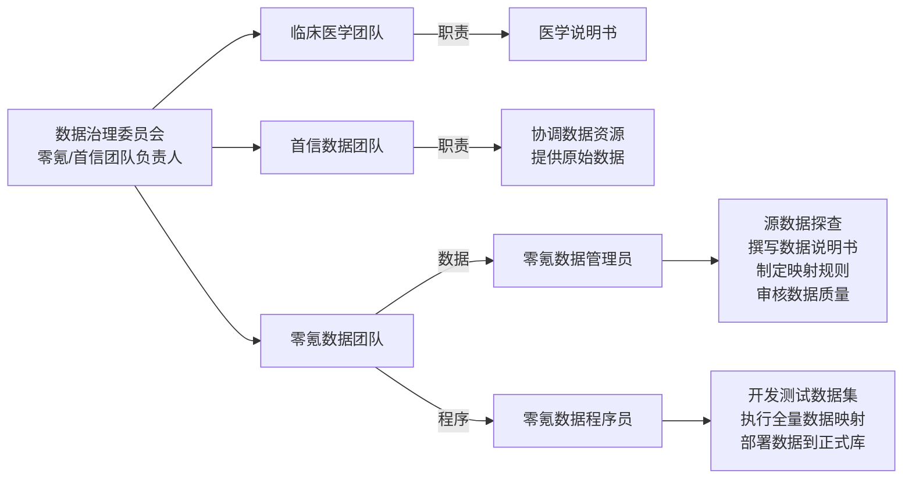
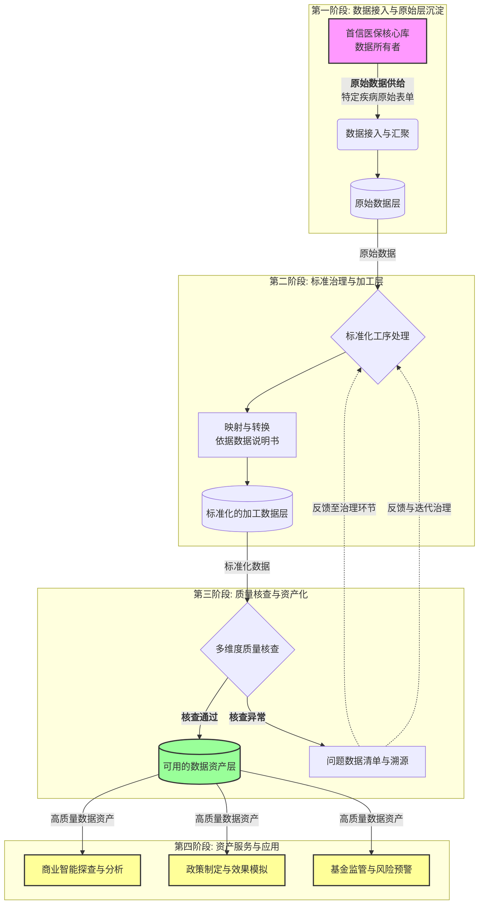

# 医保数据治理

## 1 业务拆解

### 1.1 项目说明

本项目旨在对医保数据库进行系统化治理，形成高质量、可用的数据资产。核心流程包括：

| 阶段                        | 核心活动                                                       | 负责角色       |
| ---- | ---- | ---- |
| **1. 医学讨论**       | 零氪医学团队与首信医学团队共同讨论划定疾病范围，提供医学说明书 | 临床医学团队   |
| **2. 源数据提取**     | 首信程序员根据医学说明书提取相应疾病数据表单，提供原数据       | 首信程序员     |
| **3. 数据探查与设计** | 撰写《数据说明书》（含数据字典、映射规则等）                   | 零氪数据管理员 |
| **4. 测试数据制备**   | 根据《数据说明书》生成并提交测试数据集                         | 零氪程序员     |
| **5. 测试数据审核**   | 审核测试数据集映射准确性，并迭代更新《数据说明书》             | 零氪数据管理员 |
| **6. 全量数据映射**   | 依据审定后的《数据说明书》，完成医保全量数据的映射转换         | 零氪程序员     |
| **7. 全量数据核查**   | 在测试库中完成全维度数据质量核查与验证                         | 零氪数据管理员 |
| **8. 数据资产交付**   | 将验收通过的数据从测试库迁移至正式库，支撑商业探查             | 零氪程序员     |

### 1.2 组织架构与职责分工

本项目采用协同治理模式，关键角色与职责如下：

#### 角色职责明细

- 数据治理委员会：由零氪与首信数据团队负责人共同组成，负责总体协调、决策与质量把关
- 数据所有者：首信医保数据库，作为原始数据的提供方和权威来源。
- 临床医学团队：提供特定疾病领域相关信息，包括名称、编码、描述等
- 首信数据团队：负责提供特定疾病领域的原始数据，并协助进行数据协调与解释。
- 零氪数据管理员：是数据治理的核心执行者，负责：
  - 源数据探查与需求分析。
  - 撰写与维护核心文档（数据管理计划、数据核查计划、源数据映射规则、数据字典、源数据评估报告）。
  - 审核程序员提交的测试集与全量数据的映射准确性
- 零氪程序员：是数据生产的技术执行者，负责：
  - 根据数据管理员撰写的数据说明书和映射规则，进行开发工作，生成测试数据集。
  - 根据审核通过的规则，对医保全量数据进行映射、转换与处理。
  - 完成数据从测试库到正式库的迁移部署。

### 1.3 数据流转与治理流程

本项目的数据流转遵循 “数据入湖-标准治理-质量核查-资产化-应用服务” 的全生命周期管理理念，旨在构建安全、合规、高效的数据供应链

## 2 指标体系

### 2.1 业务目标

- 对源数据充分探查以后可以覆盖整个项目的数据说明书
- 程序映射后的映射结果符合标准的专病库数据集
- 可以支持协同商务医学团队和其他药企进行沟通的专病库：

| 维度 | 具体目标 | 文件 |
| ---- | ---- | ---- |
| **1. 核心数据产出** | 形成覆盖疾病全周期，符合国际标准(SDTM)的高质量专病数据资产  | 专病库数据说明书 |
| **2. 过程与质量**   | 建成端到端的数据治理流水线和协同规范，确保源数据到可用资产的转化过程清晰、可靠、可复用 | 数据评估报告 |
| **3. 业务赋能**     | 提供一个安全、可信、易于使用的数据资产平台，为内外部门团队(例如医学、药企合作伙伴、商务)提供高效的数据支持，缩短数据获取周期，降低沟通成本，助力证据生成与商业决策 | 数据探查说明书 |

### 2.2 数据集设计

#### 2.2.1 SDTM数据设计标准
SDTM (Study Data Tabulation Model)是国际医学研究领域广泛采用的数据标准，旨在规范临床数据的结构和内容，提升数据的可交换性和可复用性，本项目的数据集设计将严格遵循SDTM标准，确保数据资产具备国际通用性和高质量要求

**核心设计原则:**
- 数据结构标准化: 所有的数据表均采用SDTM推荐的结构(如域、变量命名规范)
- 字段定义清洗: 每个字段均有明确的定义、类型、取值范围及业务含义
- 兼容性与扩展性: 支持后续多疾病、多中心数据的扩展
- 元数据管理: 每个数据集均配套数据字典和映射规则,便于追溯和管理

**设计思路**
- 变量角色: 标识符变量(identifier)、主题变量(Topic)、时间变量(Timing)、修饰符变量(Qualifier)

**主要SDTM域举例:**
以肺癌为例
| 域名 | 说明 | 经典字段 |
| ---- | ---- | ---- |
| dg | 诊断信息 | subjid, umrid, dgdtc, dgcat, dgterm, dgcode |
| sv | 访视信息 | subjid, umrid, svdtc, svcat, hospital, hospcode |
| ex | 药物信息 | subjid, umrid, exstdtc, excat, extrt, excode |
| he | 费用明细 | subjid, umrid ,hedtc, hecat, henam, hecode |
| dm | 个人信息 | subjid, sex, age, nation, ethnic, brthdtc |
| pr | 手术信息 | subjid, umrid, prdtc, prcat, prtrt, prcode |
| ss | 死亡信息 | subjid, death, dthdtc, dthdes, dthterm |

#### 2.2.2 数据集字段设计

## 3 数据处理

### 3.1 **映射规则**

### 3.2 **映射程序**

## 4 诊断分析

#### 4.1 *变量*

#### 4.2 *规则*

#### 4.3 *医学*

## 5 分析汇报

### 5.1 数据管理计划

### 5.2 数据核查计划

### 5.3 数据审核报告

### 5.4 源数据评估报告

## 6 策略输出

## 7 量化测算

## 8 策略落地
