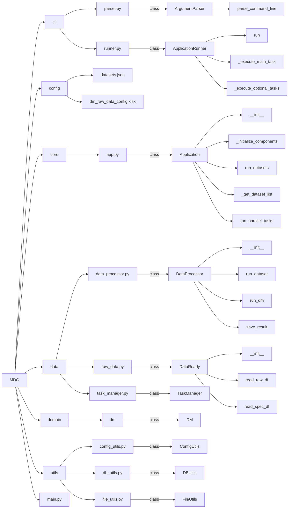

# 医保项目框架

```mermaid
graph LR
    A[MDG] --> B[cli] 
    A --> C[config]
    A --> D[core]
    A --> E[data]
    A --> F[domain]
    A --> G[utils]
    A --> H[main.py]
    B --> B1[parser.py] --> |class| B11[ArgumentParser] --> B111[parse_command_line]
    B --> B2[runner.py] --> |class| B21[ApplicationRunner] --> B211[run]
                                    B21 --> B212[_execute_main_task]
                                    B21 --> B213[_execute_optional_tasks]
    C --> C1[datasets.json]
    C --> C2[dm_raw_data_config.xlsx]
    D --> D1[app.py] --> |class| D11[Application] --> D111[__init__]
                                 D11 --> D112[_initialize_components]
                                 D11 --> D113[run_datasets]
                                 D11 --> D114[_get_dataset_list]
                                 D11 --> D115[run_parallel_tasks]
    E --> E1[data_processor.py] --> |class| E11[DataProcessor] --> E111[__init__]
                                            E11 --> E112[run_dataset]
                                            E11 --> E113[run_dm]
                                            E11 --> E114[save_result]
    E --> E2[raw_data.py] --> |class| E21[DataReady] --> E211[__init__]
                                      E21 --> E212[read_raw_df]
                                      E21 --> E213[read_spec_df]
    E --> E3[task_manager.py] --> |class| E31[TaskManager]
    F --> F1[dm] --> |class| F11[DM]
    G --> G1[config_utils.py] --> |class| G11[ConfigUtils]
    G --> G2[db_utils.py] --> |class| G21[DBUtils]
    G --> G3[file_utils.py] --> |class| G31[FileUtils]

```